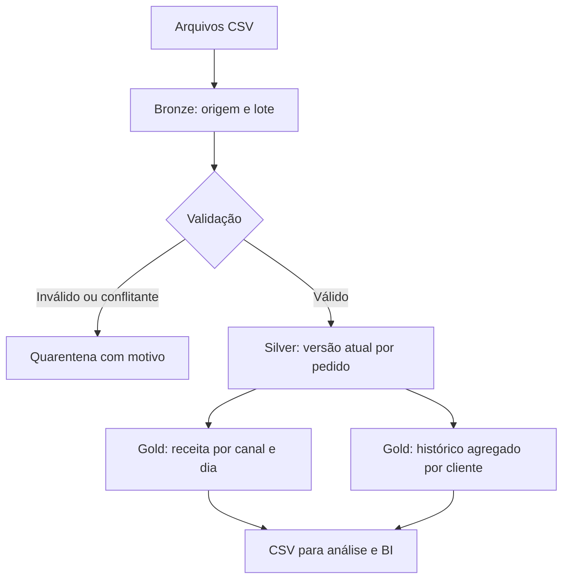

# Natanael | Engenharia de Dados

### Da pergunta de negócio ao dado confiável.

Portfólio de projetos demonstrativos em Python e SQL, com foco em pipelines reproduzíveis, qualidade e modelagem de dados para análise.

Minha experiência em marketing, produtos e novos negócios orienta as perguntas exploradas aqui: quais canais geram receita, como acompanhar a recorrência de clientes e como garantir indicadores consistentes quando os dados mudam?

**Projeto em destaque:** [Revenue Data Pipeline](docs/case-study.md) — processamento incremental de pedidos, tratamento de inconsistências e construção de duas camadas analíticas.

> Todos os dados são fictícios. Este repositório é um projeto de portfólio desenvolvido com apoio de IA, sem dados de clientes ou empresas e sem alegações de implantação em produção.

## O que você encontra aqui

| Evidência técnica | Implementação |
| --- | --- |
| Ingestão incremental por arquivo | Identificação de lote por SHA-256 e controle de reprocessamento |
| Arquitetura Medallion local | Bronze com registros de origem, Silver validada e Gold em SQL |
| Qualidade de dados | Contrato de colunas, validação de datas e valores, quarentena com motivo |
| Atualizações e eventos atrasados | Upsert pela chave do pedido e data de atualização |
| Modelagem analítica | Receita por canal/dia e resumo por cliente |
| Rastreabilidade | Lote de origem de cada registro e métricas de execução |
| Testes automatizados | Idempotência, correções, cancelamentos, conflitos e reconciliação |

## Execute em poucos comandos

Requisito: **Python 3.11 ou superior**. Não exige conta em nuvem, credenciais ou instalação de dependências externas.

```bash
git clone https://github.com/natanaelmoreira/portfolio.git
cd portfolio
python -m src.pipeline --input data/sample/orders_01.csv
python -m src.pipeline --input data/sample/orders_02.csv
python -m unittest discover -s tests -v
```

Se seu sistema usar `python3`, substitua `python` nos comandos.

Os comandos geram `build/warehouse.db` e os CSVs em `build/gold/`. A execução imprime um relatório JSON com volume recebido, registros rejeitados, alterações e duração. Reexecutar o mesmo lote retorna `skipped`.

### Resultado esperado após os dois lotes

| Indicador | Resultado no conjunto fictício |
| --- | ---: |
| Linhas recebidas na Bronze | 12 |
| Linhas em quarentena | 2 |
| Pedidos únicos na Silver | 6 |
| Pedidos pagos | 5 |
| Pedidos cancelados | 1 |
| Receita dos pedidos pagos | R$ 710,00 |

O segundo lote cancela um pedido, corrige o valor de outro e adiciona dois pedidos. Uma versão atrasada é preservada na Bronze e não substitui a versão mais recente na Silver.

## Arquitetura



## Navegação

- [Estudo de caso e decisões técnicas](docs/case-study.md)
- [Contrato e dicionário de dados](docs/data-contract.md)
- [Operação, limitações e evolução para nuvem](docs/operations.md)
- [Pipeline Python](src/pipeline.py)
- [Transformações SQL](sql/gold.sql)
- [Testes de comportamento](tests/test_pipeline.py)

## Escopo real

**Implementado:** processamento batch local com Python/SQLite, duas views analíticas e exportação CSV.

**Evolução proposta:** armazenamento de objetos, Parquet/Delta, processamento Spark, orquestração e dashboards. Azure, Databricks, Airflow e Power BI não são apresentados como integrações já implementadas.

Este projeto prioriza fundamentos inspecionáveis e execução simples. A seção de [operações](docs/operations.md) explica o que precisaria mudar para escala e uso em produção.
